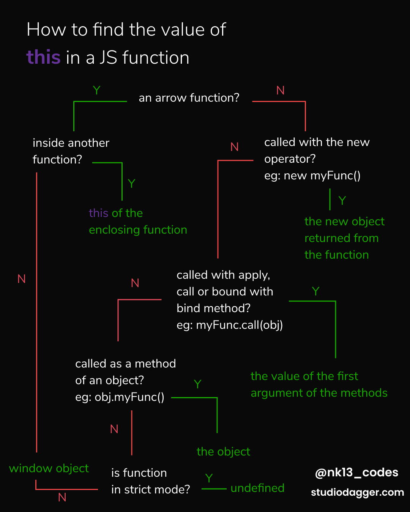

**this** is one of the features in JS that has lead to a lot of confusion among developers but as it turns out with just 4 simple rules you can easily figure out what **this** refers to in a JavaScript function.

The main source of confusion regarding **this** is that it works a little differently in other languages. The most important thing to remember when working with **this** in JavaScript is that -

_**this** is not author-time binding but run-time binding so it's not about where a function is declared but how it's called_

In JS there are 4 different types of **this** bindings and they have their own order of precedence. So here are the 4 different **this** bindings in ascending order of precedence.

1. **Default binding**:
   If any of the other bindings are not applied then the default binding is applied. Most of the function calls in your code probably have default binding. The value of this is bound by default to the global object (the window object when working with JS in the browser). Default binding happens when you call a function with just the function name and it's arguments within brackets.

   _**Note**: If the function is in strict mode then by default **this** refers to undefined_

   ```javascript
   function foo() {
     /**
      *   creates a global variable a
      *    and is equivalent to var a = 4;
      *    in the global scope
      *    or window.a = 4;
      **/
     this.a = 4;
   }

   foo();
   console.log(a); // 4

   function bar() {
     "use strict";
     /**
      * since this is undefined in strict mode
      * a cannot be set and it
      * results in an error
      */

     this.a = 6;
     console.log(a);
   }
   bar(); // TypeError: Cannot set property 'a' of undefined
   ```

2. **Implicit Binding**:
   This type of binding happens when the function is called as a method of an object. The value of **this** is the object itself.

   ```javascript
   obj = {
     a: 4,
     foo: function() {
       console.log(this.a);
     }
   };
   obj.foo(); // 4
   ```

   It does not matter where the function is declared, just as long as it is called as a method of the object

   ```javascript
   function foo() {
     console.log(this.a);
   }

   obj = {
     a: 7,
     foo: foo
   };

   obj.foo(); // 7
   ```

   Only the top/last level of an object property reference chain matters.

   ```javascript
   function foo() {
     console.log(this.a);
   }
   const obj1 = {
     a: 4,
     foo: foo
   };
   const obj2 = {
     a: 7,
     obj1: obj1
   };
   obj2.obj1.foo(); // 4
   ```

   Implicitly bound functions can loose thier binding when assigned to other variables and are called by that variable

   ```javascript
   function foo() {
     console.log(this.a);
   }

   const obj = {
     a: 7,
     foo: foo
   };

   /**
    *  only a reference to the actual function is assigned
    * it does not care about the implicit binding
    */
   const bar = obj.foo;

   var a = 11;

   /**
    * here this refers to the window object because of
    * default binding
    **/
   bar(); // 11
   ```

3. **Explicit Binding**:
   Most of the built-in functions and all user-defined functions have two special utility methods, apply and call which can be used to call the functions. Explicit binding happens when you use those two special methods. The value of **this** is really easy to figure out because it is expicitly passed in as the first argument to the call or apply methods.

   ```javascript
   function foo() {
     console.log(this.a);
   }

   const obj = {
     a: 4
   };

   /**
    * calls the foo function
    * where this is bound to the obj object
    */
   foo.call(obj); // 4
   ```

   _**Note**: apply and call both works the same for explicitly binding this to the given value but the way they pass in other arguments is a little different. You can read more about them [on the MDN docs](https://developer.mozilla.org/en-US/docs/Web/JavaScript/Reference/Global_Objects/Function/apply)_

   _**Note**: you may have used the .bind() es6 method before which uses explicit binding under the hood, you can read more about the bind method [on the MDN docs](https://developer.mozilla.org/en-US/docs/Web/JavaScript/Reference/Global_Objects/Function/bind)_

4. **new binding**:

   To understand this type of binding you have to first understand how constructors work in JavaScript. In JS constructors are just functions that happen to be called with the new operator in front of them. They are not attached to classes nor are they instantiating a class. They are just regular functions hijacked by the use of new in their invocation.

   Any user-defined or built-in function can be called with a new in front of it and that makes it a construction call. There is no such thing as constructor functions but rather construction calls of functions.

   Following things are done when a constructor call is made

   1. A brand new object is created
   2. the new object is prototype linked
   3. the object is set as the **this** binding for the function call
   4. unless the function returns it's own alternate object , the new invoked function call will return the newly constructed object.

   ```javascript
   function foo() {
     this.a = 4;
   }
   const bar = new foo(); // bar is set to the newly created object;
   console.log(bar.a); // 4
   ```

   5. **Arrow Functions**:
      I know I promised there were only 4 different types of **this** binding and traditionally that was true until es6 when arrow functions were introduced.

      ```javascript
      /**
       *  arrow functions use the fat arrow =>
       * instead of the function keyword.
       */

      a => {
        console.log(a);
      };
      ```

      Arrow functions are not just a quicker way to write functions but they also do **this** binding a little different. They use lexical scope for **this**. If you wanna read more about lexical scope I have a [post about that too](https://www.studiodagger.com/lexical-scope-and-closures). But all you need to know about the **this** in arrow functions is that they inherit the value of **this** from thier inclosing function and I mean the function where the arrow functions are declared inside and not where they are actually called.

      ```javascript
      function foo() {
        return () => {
          /**
           * here this actually refers to the
           * this of the foo function
           */

          console.log(this.a);
        };
      }
      const obj1 = {
        a: 4
      };
      const obj2 = {
        a: 7
      };
      /**
       * sets this binding to obj1 and
       * gets the arrow function as the return value
       * then tries to set the this binding
       * of the arrow function to obj2 but
       * the arrow function's this is set
       * to the this of foo which was bound to obj1
       **/
      const bar = foo.call(obj1);
      bar.call(obj2); // 4
      ```

      Therefore, the **this** binding of arrow function is actually done in author-time rather than run-time like the other types of **this** binding.

   Here is a cheatsheet that can help you find the value of **this** in JavaScript.


