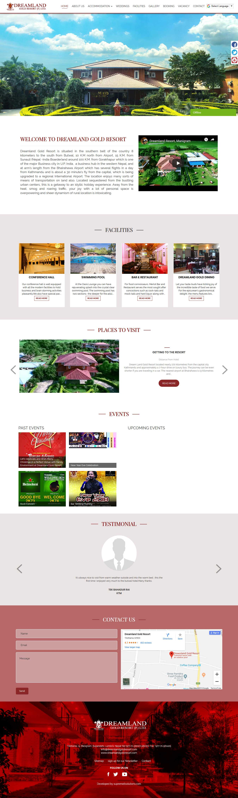

### Project Overview

Dreamland Gold Resort is sandwiched between Lumbini (Buddha's Birthplace) and Devdaha (his maternal home), two of the most globally renowned and sacred places on earth. The resort offers beautifully decorated rooms, soothing environment with spectacular views of the lush garden and country paddy field from the large windows of the rooms. The Resort already had a website but they were not satisfied with it's performance and the outdated design didn't reflect the brand of this luxury resort. Therefore I had the task of fulfilling the following objectives by completely redesigning the site:

- Update the design to reflect the brand of the resort
- Inform the site visitors about the facilities and history of the resort
- Make sure the site visitors can easily browse the important details about the resort like venues, contact details, room availability, etc
- Implement an easy to use booking system

### The Process

As the lead designer and developer of the site, I had to figure out how to fulfil these objectives while creating a beautiful and easy to use resort website with the ability to do online bookings. A resort website has to do mainly two things - make the resort look good which was easy to do for such a great resort and communicate all the relevant details about the hotel to the potential guests to make sure they have all the information they need in order to plan their stay. I also needed to implement a user friendly booking system for this particular resort website. Therefore I used the following tactics to make sure the redesign of this resort website would be perfect :

- Highly stylised color palette juxtaposed - with a simple more conventional layout
- which made it stylish but user-friendly
- Elegant typography to go with the established brand of the resort as a place for luxury vacations
- Clear and simple navigation
- Use of Vibrant exciting imagery
- A step by step easy to use booking system

### The Result

After the design and deployment of the site, the results were clear and easy to understand thanks to google analytics and booking data. The following positive trends were seen after the launch of the site:

- 25% more bookings
- 7% increase in customer satisfaction
- A significant increase in user enquiries about the - resort
- A more streamlined booking process

Note: Due to some interactive scroll based animations the screenshot does not fully include some blocks of the site, to see what the site really looks like please visit [the live site](dreamlandgoldresort.com)

