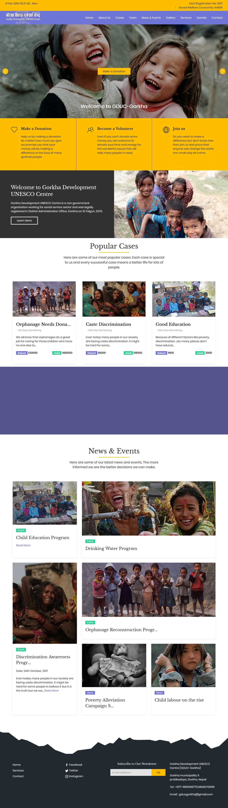

### Project Overview

Gorkha Development UNESCO Center is a non-government organization working for the social service sector and was legally registered in the District Administration Office, Gorkha, Nepal. I had the pleasure of designing and developing the website of this great organization that does some great work helping the poor people of Gorkha. The main objectives of the website were the following:

- Inform the site visitors about the organization and the important work that it's doing
- Communicate the values and goals of the organization to the site visitors
- Increase the funding by proving an easy way to donate money to the organization

### The Process

As the lead designer and developer of the site, I had to figure out how to fulfil these objectives while creating a compelling and insightful website with a section to donate to the organization. A website for such organizations needs to properly convey how important their work is and why you should donate. I also needed to implement a donation form where visitors could donate some money. I used the following tactics to make sure all the goals of this website could be fulfilled as soon as possible :

- Strong Imagery used to emphasize the helplessness of the people of Gorkha
- Scrolling animations to make sure the visitors are engaged to the content
- Simple and straightforward copywriting
- A step by step easy way to make a donation

### The Result

After the design and deployment of the site, the results were clear and easy to understand thanks to google analytics and donation data. The following positive trends were seen after the launch of the site:

- an impressive 45% increase in donations
- 20% growth in volunteer numbers

Note: Due to some interactive scroll based animations the screenshot does not fully include some blocks of the site, to see what the site really looks like please visit [the live site](https://gducgorkha.org.np/)

