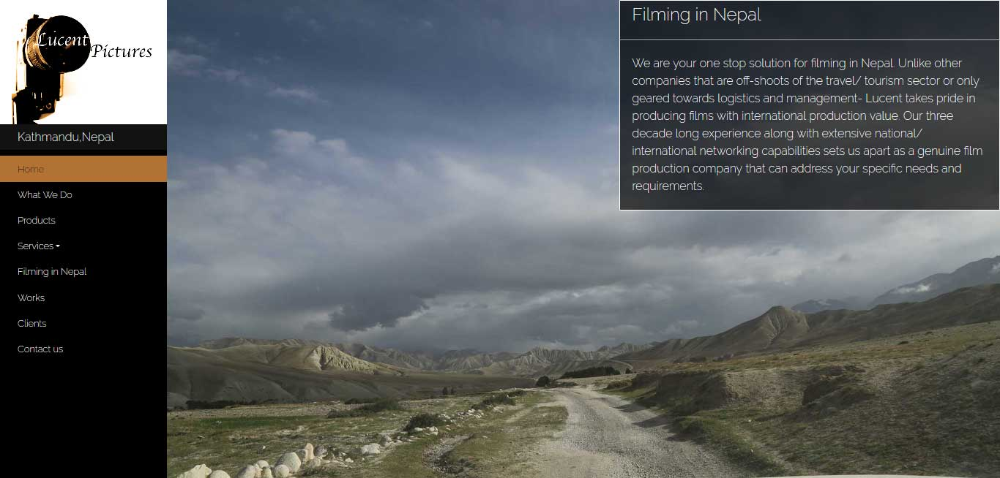

### Project Overview

Lucent Pictures are image acquisition specialists with a passion for creative storytelling. They make feature-length documentaries, advertisements, narrative films, educational videos and PSAs. They also deliver industry standard digital film editing, subtitling, transcription, voice-over and dubbing services to select international clients. I was in charge of designing and developing a website that was a true reflection of their incredible creative work.

The main objectives of the website were the following:

- Inform the site visitors about the Lucent Pictures and their work
- Communicate the values and goals of the organization to the site visitors
- Inform the visitors how to get in touch
- tell the story of lucent pictures in a creative way

### The Process

As the lead designer and developer of the site, I had to figure out how to fulfil these objectives while creating a compelling and engaging website. A website for such a creative agency needs to be playful and interactive at the same time showcasing their work how you can contact them. I used the following tactics to make sure all the goals of this website could be fulfilled as soon as possible :

- Use of a lot of great images and a video provided by Lucent pictures
- Scrolling animations to make sure the visitors are engaged to the content
- Simple copywriting juxtaposed with strong visuals

### The Result

After the design and deployment of the site, the results were clear and easy to understand thanks to google analytics and donation data. The following positive trends were seen after the launch of the site:

- 8 new clients within the first month
- 20% increase in views on their Vimeo channel

