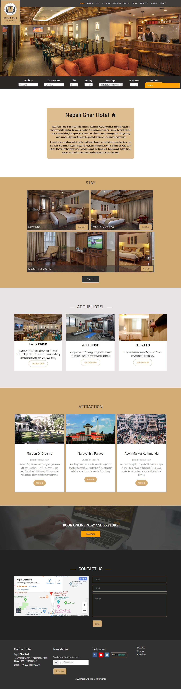

### Project Overview

Nepali Ghar Hotel is a Nepalese Hotel designed and crafted in a traditional way to provide an authentic Nepalese experience whilst meeting the modern comfort, technology and facilities. I had the task of fulfilling the following objectives by designing and developing the site:

- Ensure the design of the site to reflects the brand of the hotel
- Inform the site visitors about the facilities of the hotel
- Make sure the site visitors can easily browse the important details about the resort like venues, contact details, room availability, etc
- Implement an easy to use booking system

### The Process

As the lead designer and developer of the site, I had to figure out how to fulfil these objectives while creating a beautiful and easy to use hotel website with the ability to do online bookings. A hotel website has to do mainly two things - make the hotel look good which was easy to do for such a great hotel and communicate all the relevant details about the hotel to the potential guests to make sure they have all the essential information they need in order to plan their stay. I also needed to implement a user friendly booking system for this particular resort website. Therefore I used the following tactics to make sure the design of this hotel website would be perfect :

- A brownish color palette that matched the texture of the hotel with some rich blacks to represent a sense of luxurious handcrafted design to ensure it stays true to the brand of the hotel
- Elegant typography to go with the brand of the hotel as a place for luxury vacations
- Clear and simple navigation
- Use of Vibrant exciting imagery
- A step by step easy to use booking system

### The Result

After the design and deployment of the site, the results were clear and easy to observe thanks to googling analytics and booking data. The following positive trends were seen after the launch of the site:

- 29% more bookings
- 10% increase in customer satisfaction
- A significant increase in user enquiries about the hotel
- A more streamlined booking process

Note: Due to some interactive scroll based animations the screenshot does not fully include some blocks of the site, to see what the site really looks like please visit [the live site](https://www.nepaligharhotel.com/)

