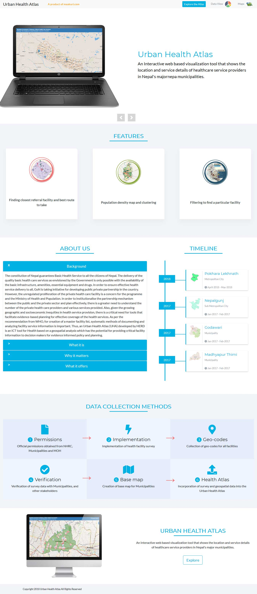

### Project Overview

Urban Health Atlas is an Interactive web-based visualization tool that shows the location and service details of healthcare service providers in Nepal's major cities. It provides detailed information about all health facilities and their location on a live map. The main objectives of this site were as follows:

- Showcase all the key features of Urban Health Atlas
- Inform the site visitors about the history, use cases and need for Urban Health Atlas
- Demonstrate how Urban Health Atlas works

### The Process

As the lead designer and developer of the site, I had to figure out how to fulfil these objectives while creating a compelling and easy to use landing page for this remarkable tool. For any landing page, the most important thing is that it has to be effective and it has to communicate it's ideas to the site visitors in a clear but engaging way. Therefore I used the following tactics to make sure this landing page would get the job done:

- A minimalist design with a highly legible font and limited colour palette
- Simple and Straightforward copywriting
- Iconography with clear labels
- Simple Navigation and a couple of Call to action buttons placed in key places
- Use of actual screenshots of the app to demonstrate the use of the app

### The Result

After the design and deployment of the site, the results were clear and easy to understand thanks to google analytics and user data. The following positive trends were seen after the launch of the site:

- 69% increase in site traffic
- 35% user growth
- A significant decrease in user complaints

